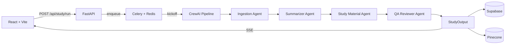

# StudyAI 🧠

> AI-powered notes summariser and study material generator built on **CrewAI** multi-agent orchestration.

Paste any text — lecture notes, textbook excerpts, articles. Four AI agents collaborate to generate a complete study package in seconds.

## Architecture



## Tech Stack

| Layer        | Technology                         |
|--------------|------------------------------------|
| Frontend     | React 18, Vite, Tailwind CSS, Zustand, React Flow |
| Backend      | FastAPI, Python 3.11, SSE           |
| AI Agents    | CrewAI, Claude Sonnet 3.5           |
| Task Queue   | Celery + Redis                      |
| Database     | Supabase (Postgres + Auth)          |
| Vector DB    | Pinecone                            |
| Export       | genanki (Anki), reportlab (PDF)     |

## Quickstart

```bash
# 1. Clone and configure
cp .env.example .env
# Edit .env with your API keys

# 2. Start everything
docker-compose up --build

# 3. Open the app
open http://localhost:5173
```

## Environment Variables

| Variable                  | Required | Description                              |
|---------------------------|----------|------------------------------------------|
| `ANTHROPIC_API_KEY`       | ✅       | Your Anthropic API key                   |
| `ANTHROPIC_MODEL`         | ✅       | Model name (default: claude-sonnet-4-20250514) |
| `SUPABASE_URL`            | ✅       | Supabase project URL                     |
| `SUPABASE_ANON_KEY`       | ✅       | Supabase anon public key                 |
| `SUPABASE_SERVICE_KEY`    | ✅       | Supabase service role key (server only)  |
| `PINECONE_API_KEY`        | ✅       | Pinecone API key                         |
| `PINECONE_INDEX_NAME`     | ✅       | Pinecone index name                      |
| `PINECONE_ENVIRONMENT`    | ✅       | Pinecone region (e.g. us-east-1)         |
| `REDIS_URL`               | ✅       | Redis connection URL                     |
| `CELERY_BROKER_URL`       | ✅       | Celery broker (Redis)                    |
| `CELERY_RESULT_BACKEND`   | ✅       | Celery result backend (Redis)            |
| `APP_DEBUG`               | ❌       | Enable debug mode (default: true)        |
| `CORS_ORIGINS`            | ❌       | Comma-separated allowed origins          |

## API Reference

| Method | Endpoint                        | Description                          |
|--------|---------------------------------|--------------------------------------|
| POST   | `/api/study/run`                | Queue a pipeline run                 |
| GET    | `/api/study/stream/{job_id}`    | SSE stream of agent progress         |
| GET    | `/api/study/result/{job_id}`    | Get completed study package          |
| GET    | `/api/study/history`            | Paginated user history               |
| GET    | `/api/study/export/pdf/{job_id}`| Download PDF export                  |
| GET    | `/api/study/export/anki/{job_id}`| Download Anki .apkg deck            |
| GET    | `/api/study/export/markdown/{job_id}`| Get Markdown export            |
| GET    | `/api/health`                   | Health check                         |
| POST   | `/api/auth/verify`              | Verify Supabase JWT                  |

## Development

```bash
make install    # install all deps
make dev        # docker-compose up --build
make test       # run pytest + tsc
make lint       # ruff + eslint
make logs       # tail all service logs
make down       # stop all services
```

## Test Locally (No Docker)

```bash
cd backend
pip install -r requirements.txt
export ANTHROPIC_API_KEY=your_key_here
python ../scripts/test_crew_local.py --text "Your notes here..." --mode all
```

## Project Structure

```
studyai/
├── backend/         FastAPI + CrewAI + Celery
│   ├── crew/        Agents, tasks, tools, prompts
│   ├── api/         Routes + middleware
│   ├── services/    Redis, Supabase, Pinecone, Export
│   └── workers/     Celery tasks
├── frontend/        React + Vite + Tailwind
│   └── src/
│       ├── components/  AgentPipeline, FlashcardDeck, MindMap...
│       ├── pages/       Dashboard, StudySession, History
│       └── store/       Zustand state
├── infra/           Supabase migrations, Pinecone setup
├── scripts/         Local test + seed scripts
└── docs/            Architecture diagrams + research
```

## Contributing

1. Fork the repo
2. Create a feature branch (`git checkout -b feat/my-feature`)
3. Run tests (`make test`)
4. Submit a PR with a clear description

## License

MIT
